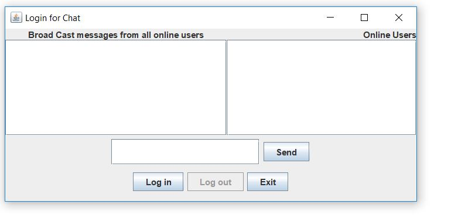

# Chat_Server
Users can interact to each other. They can share information to all others.

# Requirement to run this project=>

<b>1) JRE</b> 
<b>2) java</b>

# How to run this project=>

Run the server first, write: java MyServer

Now click on the executable jar file MyClient as many as you want. It will open different dialog boxes. Now try to communicate with each other.
click on the login button and enter your name, now you can share information.

# Screenshots
 

